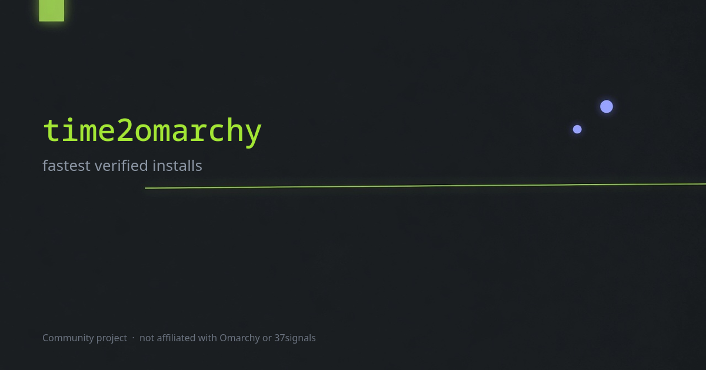

# time2omarchy

[](https://github.com/xgborgeso/time2omarchy/actions/workflows/check.yml)

A leaderboard for the fastest [Omarchy](https://omarchy.org) installs. Community
project, not affiliated with Omarchy or DHH.

**[time2omarchy.com](https://time2omarchy.com)**



## How it works

Install Omarchy, photograph the boot screen with your time on it, and post it.
Ranking goes through X, so the handle on an entry is the one X answered with and
there is nothing to impersonate. The boot screen is the only check on a time, and
anyone can flag one.

The photo is redrawn in the browser before it is uploaded, which strips the EXIF
a phone attaches and turns four megabytes into a few hundred kilobytes.

## Running it locally

```bash
cp .env.example .env   # then fill it in
pnpm bootstrap         # dependencies, database, seed data
pnpm dev               # http://127.0.0.1:3000
```

The seeded board renders with an empty `.env` — a hundred and twenty entries, and
the stats and rules pages work. Only *ranking* needs credentials, because it goes
through X and UploadThing, and both are third parties in development too.

Use `127.0.0.1`, not `localhost`. X refuses to register a `localhost` OAuth
callback, and cookies are per-host, so a session started on one is not sent to
the other.

## Commands

| | |
|---|---|
| `pnpm dev` | development server |
| `pnpm bootstrap` | dependencies + a freshly seeded database |
| `pnpm test` | Vitest |
| `pnpm lint` | Biome |
| `pnpm typecheck` | `tsc --noEmit` |
| `pnpm db:fresh` | reset and reseed — the usual one |
| `pnpm db:generate` | write a migration from `src/server/schema.ts` |

Postgres runs locally through PGlite, so there is no database to install.

## Contributing

Issues and pull requests welcome. Run `pnpm test && pnpm lint && pnpm typecheck`
before opening one; CI runs the same three and production waits for them.

A missing CPU goes through [its issue template](.github/ISSUE_TEMPLATE/add-cpu.yml)
rather than a pull request, so the list stays one shape.

## Stack

Next.js, tRPC, Drizzle, Better Auth, UploadThing, and Postgres on Neon, deployed
on Vercel.

[MIT](LICENSE)
